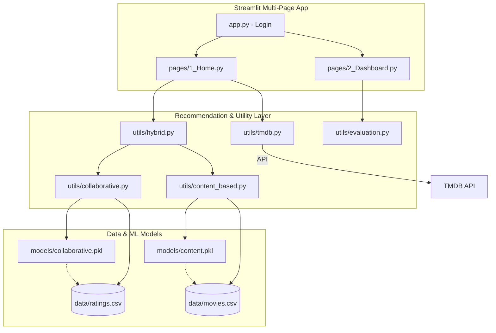

# 🎬 Netflix AI Movie Recommendation System

A production-grade, Netflix-inspired movie recommendation engine built with Streamlit and Machine Learning. The system employs a hybrid approach combining Collaborative Filtering (SVD) and Content-Based Filtering (TF-IDF) to provide personalized, high-relevance movie picks.

## 🏗️ Architecture



## 🚀 Tech Stack

- **UI Framework**: Streamlit (Multi-Page)
- **ML Engine**: Scikit-Learn (TF-IDF), Scikit-Surprise (SVD)
- **Data Handling**: Pandas, NumPy
- **Visuals**: Plotly Express, Custom Vanilla CSS (Netflix-Style)
- **API**: TMDB API (for dynamic movie posters)
- **Persistence**: Pickle Serialization

## 🛠️ Local Setup

### 1. Prerequisites
- Python 3.9+
- Microsoft C++ Build Tools (Required for `scikit-surprise`)

### 2. Installation
```bash
git clone https://github.com/Sowji0118/movierecommendation.git
cd movierecommendation
pip install -r requirements.txt
```

### 3. Configuration
1. Create a `.env` file from the example:
   ```bash
   cp .env.example .env
   ```
2. Add your [TMDB API Key](https://www.themoviedb.org/documentation/api) to the `.env` file:
   ```env
   TMDB_API_KEY=your_actual_key_here
   ```

### 4. Running the App
```bash
streamlit run app.py
```

## ☁️ Deployment

To deploy in a production environment (e.g., Docker, Heroku, or Streamlit Cloud):

**CLI Execution Command:**
```bash
streamlit run app.py --server.port $PORT --server.address 0.0.0.0
```

## 📊 Analytics & Metrics

The system tracks performance using:
- **RMSE**: Root Mean Square Error for rating precision.
- **Precision@K**: Relevance of top-K results.
- **Recall@K**: Capacity to surface all relevant items.

## 🔮 Future Improvements

- [ ] **Real-time Rebuilding**: Implement incremental model updates as new ratings arrive.
- [ ] **Advanced NLP**: Use BERT or Sentence Transformers for deeper content understanding.
- [ ] **Deep Learning**: Explore Neural Collaborative Filtering (NCF).
- [ ] **Cloud Storage**: Migrate CSV data and Pickle models to AWS S3 or Google Cloud Storage.

---
Built with ❤️ by [Sowji0118](https://github.com/Sowji0118)
